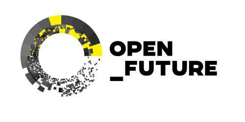

{:class="logo"}

A group of long-term experts, producers, and organizers of the Digital Commons (gender-balanced albeit Western-centric) gathered in Berlin in May 2023 to discuss and strategize about the future of the open movement through a three-day session. The group came to a series of conclusions that may serve as a base to better nurture and defend the Digital Commons.

The report presented here serves as one step, summarizing and contextualizing said conclusions. It could also, potentially, be used as a tool for advocacy, organization, and action in the future.

* [Context and background](/report.html#context-and-background)
* [The "Digital Commons"?](/report.html#the-digital-commons)
* [Problematization](/report.html#problematization)
* [The strategic lines of tension](/report.html#the-strategic-lines-of-tension)
* [Politics](/report.html#politics)
* [Socio-economics](/report.html#socio-economics)
* [Equitable participation](/report.html#equitable-participation)
* [Boundaries of the movements](/report.html#boundaries-of-the-movements)
* [Next steps](/report.html#next-steps)

[Download as PDF (1.9 Mb)](/assets/Problematizing_Strategic_Tensions_in_the_Digital_Commons.pdf){: .btn .btn--info .btn--large}

We welcome feedback and reflection that the report might provoke.

Please share any thoughts you might have by writing to <a href="mailto:contact@tensionsincommons.net">contact@tensionsincommons.net</a>.

  

    
  

  

    
  

  

    
  

