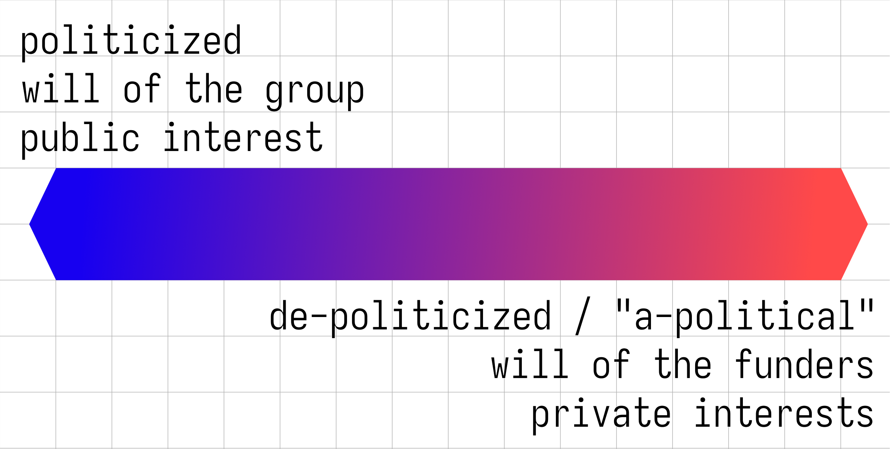
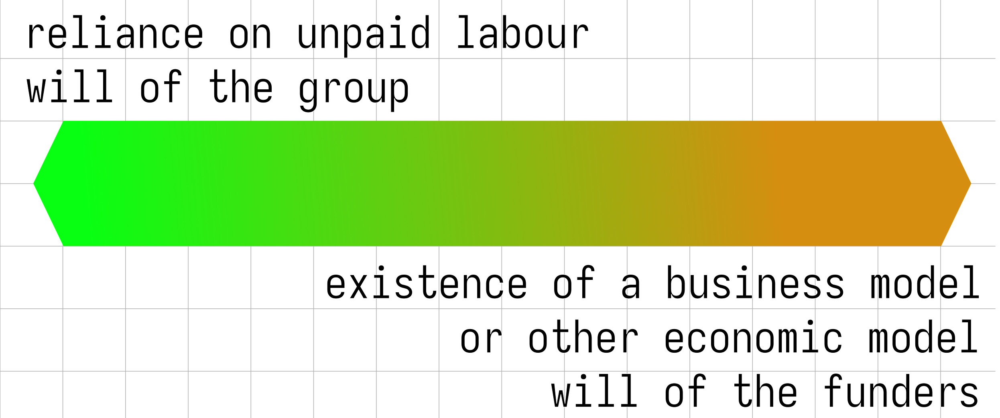
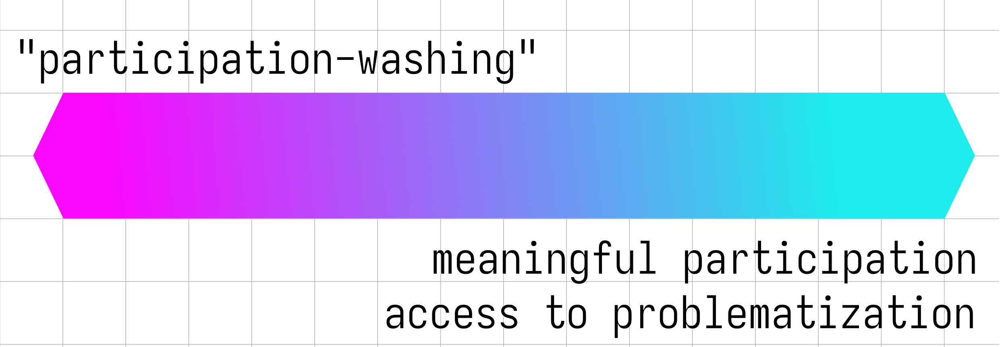
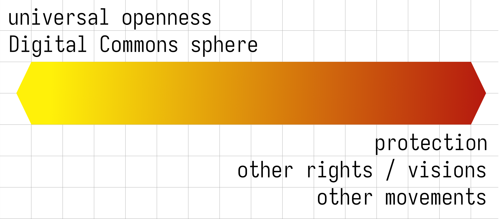

A "Final" Draft - v0.999 - 20230812

{:class="logo"}

* [Context and background](#context-and-background)
* [The "Digital Commons"?](#the-digital-commons)
* [Problematization](#problematization)
* [The strategic lines of tension](#the-strategic-lines-of-tension)
* [Politics](#politics)
  + [Questions arising on the political tension line](#questions-arising-on-the-political-tension-line)
* [Socio-economics](#socio-economics)
  + [Questions arising on the socio-economic tension line](#questions-arising-on-the-socio-economic-tension-line)
* [Equitable participation](#equitable-participation)
  + [Questions arising on the "participation" tension line](#questions-arising-on-the-participation-tension-line)
* [Boundaries of the movements](#boundaries-of-the-movements)
  + [Questions arising on the "boundaries of the movements" tension line](#questions-arising-on-the-boundaries-of-the-movements-tension-line)
* [Next steps](#next-steps)

 

## CONTEXT AND BACKGROUND 

A group of long-term experts, producers and organizers of the Digital Commons (gender-balanced albeit Western-centric) gathered in Berlin in May 2023. We discussed and thought about the future of the Digital Commons in a strategic way, through a three-days session, sharing experienced frustrations as well as dreams for a better future. We came to a series of open conclusions that may serve as a base for futher discussions and next steps, in order to better nurture and defend the Digital Commons in the future.

This document serves as one step only, summarizing and contextualizing their conclusions. Once the object of further discussion and of a broader consensus, these Strategic Tensions in the Digital Commons may be used as a tool for advocacy and further reflection, organization and action.

METHODOLOGICAL DISCLAIMERS: 

*Unless otherwise specified, elements in italics and between quotation marks are direct extracts from notes taken from the contributions during the sessions.*

*The colors used in the next pages are arbitrary, not very accessible, and only used here as an experiment.*

## THE "DIGITAL COMMONS"? 

The Digital Commons are a sphere that is much larger than the production of free/libre/open-source software and open data. During the workshop, we mapped the state of each of these fields, including key actors and key constraints that they face: 

- Free/Libre Open Source software and Infrastructure;
- Open Data;
- Knowledge and Science;
- Open Design;
- Cultural Expression and Heritage;
- Policy and Digital Participation.

 

## PROBLEMATIZATION 

Problematisation was an important cross-cutting issue that we discussed. The usual notion of *"participation"* within Digital Commons projects and communities, but also in society at large (including policymaking processes) is often limiting, biased and tainted by a number of political and socio-economical parameters. 

Way too often, participation is rail-roaded in narrow ways, according to the will of founders/leaders, and doesn't fully reflect the broad potential of human interactions nor allows for meaningful change: yes/no questions instead of truly contributing to the co-elaboration of public policy; allowing for the submission of bug reports and patches instead of contributing to the strategic choices and orientation of FLOSS projects; being able to uploading data while having no say on their organization, processing and meta-data, etc. 

(*We used the term of "participation-washing" to describe such practices.*)

 

A notion of **problematization** served better our purpose, as: 

> *"a process of stripping away common or conventional understandings of a subject matter in order to gain new insights"* (Wikipedia)

> *"a focus on the practices through which problems and potential solutions are defined and institutionalised"* (Clive Barnett, 2015)

> *"a method to exercise one’s freedom to think differently from what has been previously defined and institutionalized and to question one’s own opinions, assumptions and belief systems to identify the mystery and surprise in the phenomenon under study"* (Alvesson and Kärreman, 2007).

## THE STRATEGIC LINES OF TENSION

When prompted to decide how to formulate the outcome of their common reflection, instead of yet-another-manifesto, the group consensually decided to problematize some **tensions** visible accross these various fields in which the use and production of Digital Commons is practiced. 

Instead of binary, black/white, yes/no, one-dimension questions, these **"tension lines" must be understood more like gradients where one can position a cursor** at a given time and for a given situation. 

Some of the lines of tensions may even be *paradoxes*, spaces in which something may be black AND white at the same time!

These lines of tensions must be interpreted as being **deeply interconnected** and not independant from each other, a bit like a given taste can be described as composed by various amounts of the 5 basic tastes (saltiness, sweetness, sourness, bitterness, umami), or how a colour can be decomposed in 3 (RGB, RYB) or 4 (CMYK) components.

Each tension line is accompanied by a list of questions. They must be seen as examples for conversation starters or practical introductions for critically exploring (and problematizing) these fields. In that context, "We" can be interpreted as "We" the inviduals, or as "We", the entire project, organization or space.

**We hope discussing these tension lines may help further materialize structural and systemic problems within the fields of the Digital Commons, as well as areas where concrete efforts and resources could be invested for concrete improvements.**

**We hope they can serve as bases for further reflection on our fields and their future.**

 

## POLITICS

**The way projects or communities within the Digital Commons define their political line and values, and work towards them.** This work includes advocacy.

Tools, platforms and spaces accessible to wider audiences tend to be presented as de-politicized (to attract more people), and in some cases are based on the exploitation of users and their data (to be "for free"/gratis). Often an attempt at being *"apolitical"* is rooted in neo-liberal logic. 

> *"Producing verifiable knowledge is a political act."*

> *"commodification of hackerspaces, makerspaces, fablabs etc. allowed exponential growth - made possible when you take out political values; the less values, the more access - you take something extremely political like a hack lab, and end up in a system that's aligned with the mainstream politics."*

> *"maybe technology and technical protocols travel better than political values; maybe it's also a matter of scale, at some scale it's hard to hold on onto politics."*

> *"Wikimedia is like those hackerspaces - people don't see it as political tool, and that lets them participate together; and that's valuable, and we need to look at it more as a democratic practice (and while one must acknowledge that there are discrepancies, it is nevertheless deeply democratic, in terms of dialogue of viewpoints); if what gets people together on wiki is lack of political agenda - then that's not bad;"*

> *"Alternatives require technical expertise and if they present a political vision/vision of public interest, may be more difficult to use, they may be rejected."*

 

### Questions arising on the political tension line

- How political can we get?
- How can the political integrity of the commons projects be preserved when the messaging gets simplified to achieve greater scale? 
- When to skilfully allign the messaging with the mainstream policy agenda to use the momentum and when to tell decision-makers the truth they need to hear? 
- How dependant of power are we?
- How redistributive of power and resources are we?
- How much risk can we take to avoid exclusion? 
- How many controversies can we survive?
- Do we need infrastructures that sustain this collective action as a movement, and how democratic do they need to be?
- Do we need to start co-designing a "social contract"?

 

## SOCIO-ECONOMICS

**The influence of socio-economic parameters on the digital commons, its communities and participants.** How funding (or the absence thereof) and sector-specific economic models actively shape for better or worse access to, and the production of digital commons. How does this affect collaboration, cooperation, the circulation of knowledge, and the willingness to participate in these systems of production?

Fields, sectors and communities are not all equipped equally when it comes to participating in the digital commons. For some projects there can be a meaningful and direct connection between participation and remuneration, for others it may be more hazardous, and in many contribution to the digital commons essentially relies on one's own privileges and disposition.

In the past, this has been often criticized only as free labour issue. However, today with some distance we can also say that the socioeconomic conditions of digital commons production are crucial components for the
sustainability of these practices. Next to that, in a situation where no sustainable and inclusive models can be developed, only the most privileged person can afford to participate, which negatively impacts the cultural diversity of the
digital commons. This can have tragic consequences in terms of biases, appropriation, misrepresentation, invisibilization, and the overall direction a project may take.

At a time where platforms in which digital commons are produced and distributed, they are also increasingly used to fuel systems of surveillance, oppression, and discrimination; which also questions whether openness can be generalized or translated into a universal economic principle without causing accidental harm.
 

> *"Western EU conditions in the 90s to late 00s allowed for many to work part-time and contribute to networks of care and maintenance of digital commons. Free labour was always an issue but could be mitigated somehow. Combined with the failure of free/open discourse to seriously engage with the issues of labour and work conditions, this has led to the catastrophic situation where it is still frowned upon today to discuss the economic (mis-)constructions of free culture. With the increase of costs of life and a radical decrease of funding in the cultural sector, many of these networks collapsed, and starting new efforts is impossible for a younger generation of cultural workers living under very precarious situations, and this is even more difficult for women, queer persons, and racialized groups."*

> *"Promoting openness and the digital commons in the field of art and culture production without a situated take on the working conditions of cultural workers is simply irresponsible."*

 

### Questions arising on the socio-economic tension line

- What would be the right socio-economic models that would allow contributions to the Digital Commons without exploitation and cooptation?
- What is the role of fair economic models supporting the digital commons in globalized and interdependant economic systems? 
- Should the commons-based models replace the mainstream models, or do we rather see them as connected and interdependent alternatives?
- Under what conditions can the digital commons contribute to post-growth economics and be an allied of climate justice and social justice, as opposed to be an accelerator for ultraliberalism and laissez-faire economics?
 
 
 

## EQUITABLE PARTICIPATION 

**How participation exists within a project, community or entire field on a gradient ranging from "participation-washing" (seen here as token, meaningless actions left for participation, tailored -consciously or unconsciously- to leave no meaningful possibility to impulse change) to a meaningful participation where everyone has access to problematization.** 

There is a tension between the initial choices and vision of a small homogenous group of leaders and the need to expand the circle and therefore broaden the points of view, aspirations, capacities, etc. What choices can be made and actions taken to ensure equitable participation? What adjustments over time, when capacities and communities grow? Considering various existing governance models, a progressive engagement strategy should be designed, so the path and perspective of engagement for participants is clearly defined and visible from the start. Incentives and principles should be co-designed by the community.

Sometimes a perceived absence of governance amounts to leaving it to the dominant politics. 

 
> *"There will always be a power structure; and if it is not explicit, it prevents people from participating in structures; also the issue of missing governance; we would sometimes like not to have a power structure, but the power structures are always there."*

> *"...democratic governance as a general theme, to be pointed out in many spaces: data, protocols, etc."*

> *"Incentives for participation are crucial; we often talk about principles, but not about incentives."* 
 

### Questions arising on the "participation" tension line

- When and how should a governance model change to ensure the right level of participation to keep people engaged?
- How to build structures and processes that ensure flexibility and balance of participation to keep it meaningful? 
- What is the right balance of participation opportunities: when is equitable participation necessary, and when does it impede action?
- How and when should our work become open and consulted with others, beyond our own organization or closest network of actors? 
- How can groups avoid wasting time on performative participation?
- What measures can be taken to increase cultural diversity and inclusiveness?

## BOUNDARIES OF THE MOVEMENTS

**The notion of “universal openness” (all things and data should be opened, published, etc.) along with other rights, other visions and other movements.** 

Reaching out to other communities, outside of the sphere of the Digital Commons to ensure to be of service to them and not go against their interests and values. The ways Libre/Open principles spread through the use of Libre/Open tools and products. At the same time they are used for good when these foundational values are instruments in advancing fundamental freedoms and human rights. There is a need to ensure that Western and non-Western perspectives can co-exist within projects and communities, that local and global needs can be addressed in balance.

> *"we have moved from a space where the ultimate goal was to 'open everything for the sake of opening' to a place where we are asking ourselves more and more questions like 'who is opening what, and for whom?'"*

 

### Questions arising on the "boundaries of the movements" tension line

- When and how do we remove the Western lens and also accept that open/closed are not universal concepts?
- When should the Digital Commons movements provide service to other movements and causes and when should it give its platform to them?
  Also: When is contribution expertise and when is it "open saviourism" (ie. imposing "open everything" as a cardinal value)?
- What are the limits of openness, and in what situations should advocates of openness recommend keeping resources closed or gated?
- Through what measures and processes can the Digital Commons movements assess whether promoting openness contributes to creating or perpetuating any societal and cultural harms? 
- What are valid critiques of the Digital Commons movements inside and outside of them?
- How are rights balanced fairly? Trade-offs i.e. open vs. secure /
  Also: When is the balancing of rights necessary and when is it a false dichotomy?
- How to build strategies that give space to long-term priorities as well as emergency responses and that account for adequate resources serving both?

 

## NEXT STEPS

The strategic tension lines, as an intellectual framework and tool for problematization could be in the future submited to wider circles of consultation, in order to be themselves criticized and problematized. It is probable that some tensions are missing, as not identified yet.

They could become an object for critical engagement in further strategic processes within communities and projects in the sphere of the Digital Commons.

They could potentially also become a tool for analysis of projects for academics and freelance researchers observing and understanding the production of the Digital Commons.
 

 

*fig.1: Mockup evaluation of project XYZ through the spectrum of the strategic tensions*

